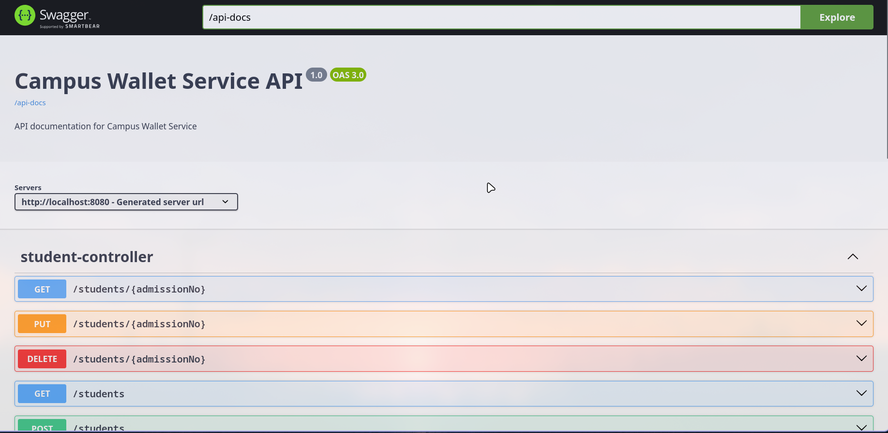
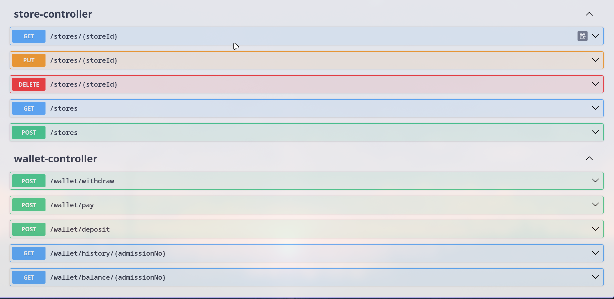

# Campus Wallet Service

A Spring Boot 3 RESTful service for managing campus wallet transactions for students and stores.

# How to run the app:
Make sure to follow the steps without fail:

In the project root, do the following steps:

Start the database: 

```sh:
docker compose up -d
```

Build the docker image of the spring boot app: 

```sh:
docker build -t wallet-service
```

Now, run the command to start the app:

```sh:
docker run -p8080:8080 --network campus-wallet-service_wallet-network wallet-service
```
Now checkout all the routes from the url:
```
http://localhost:8080/swagger-ui/index.html/
```

## Features
- Student, Store, Transaction entities (JPA)
- CRUD APIs for students and stores
- Wallet operations: deposit, withdraw, pay, check balance, transaction history
- PostgreSQL database integration
- DTOs for request/response
- Exception handling
- Swagger/OpenAPI documentation
- Role-based Spring Security (Admin vs Student)

## API Documentation





## Getting Started
1. Configure PostgreSQL in `src/main/resources/application.properties`.
2. Build and run the project:
   ```sh
   mvn spring-boot:run
   ```
3. Access Swagger UI at `http://localhost:8080/swagger-ui.html`

## API Endpoints
- `/students` - CRUD for students
- `/stores` - CRUD for stores
- `/wallet/deposit` - deposit money
- `/wallet/withdraw` - withdraw money
- `/wallet/pay` - make a payment at store
- `/wallet/balance/{admissionNo}` - get balance
- `/wallet/history/{admissionNo}` - get transaction history

## Testing
```sh:
    mvn test 
```
## Security
- Admin: access to all endpoints
- Student: access to wallet endpoints

